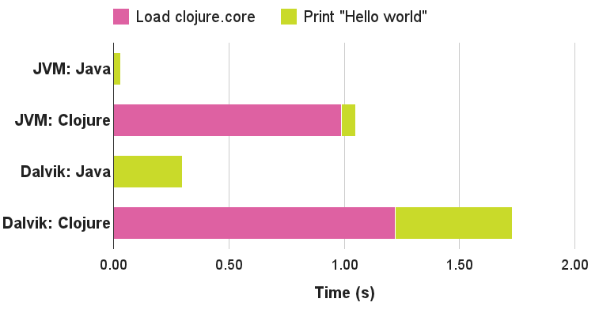
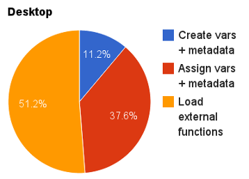

---

# ホットリローダブルなDI Clojure App

- clj-ebisu #1 2017/11/17
- 株式会社シグニファイア代表 中村研二 (github: k2n, twitter: @k2nakamura)

---

## 発表者について

- 93-00年 野村総合研究所、00-16年 米国スタートアップ数社で勤務
- 15年からフルタイムでClojure開発
- 15年、200億円規模の米国証券バックオフィスシステムにClojureを適用
    - compojure-api, core.async, aleph, manifold, gloss, mysql, mongo db, docker, AWS
- 16年、Clojure+Docker+Micro Services+AWSでビスポーク開発を提供する株式会社シグニファイアを設立
- 16年、たばこ卸売業向けEコマースとたばこ税申告システム
    - AWS Lambda, Incanter, compojure-api, reagent, postgresql, docker, rancher, AWS
- 17年、グローバル法律事務所紹介ネットワークシステムでLegalWeek Innovation Awardsを受賞
    - reagent, re-frame, compojure-api, elastic search, postgresql, docker, rancher, AWS

---

## なぜホットリローディングしたいのか？

- REPLの起動が遅い
    - 再起動の回数を減らすしかない！|
-  Clojureの動的言語の特性を活かしたい
    - 変更をすぐに反映して確認したい! | 

---

## なぜClojureの起動は遅いのか？

- http://blog.ndk.io/clojure-bootstrapping.html


---

## clojure.coreローディング時間の内訳



---

## require :reload

- clojure.core.require ... ライブラリをローディング
    - :reload-allは依存するライブラリをディープリロードする。

```clojure
users=> (require 'my-ns.foo :reload)
```

- しかし... |
- お互いに参照するNamespaceを変更した場合、正しい順番でリロードしなければならない。 |
- 定義をファイルから削除してもメモリに残っている。 |
- defmulti, defprotocol, macroを含むNamespaceをリロードする場合、それらを利用・実装しているコードもリロードしなければならない。 |
- 自分で管理するのは大変... |

---

## weavejester/ns-tracker

- リロードの順番を管理してくれるライブラリ
- 後述するclojure.tools.namespaceの一部機能を利用している。
- [Athosさんのパッチ](https://github.com/weavejester/ns-tracker/pull/17) 
- 削除したシンボルがリロード後もメモリに残っていることに注意 
- デモ |
- いちいちリロードを手動で呼ぶのはめんどくさいので... |
---

## weavejester/ring

---?code=ring-devel-demo/resources/reload.clj&lang=clojure

@[1-5]
@[21-37]
@[7-19]
 
---

## clojure.tools.namespace

- tools.namespaceはns-trackerと違い、古いコードを破棄する 
- デモ |

---

## clojure.tools.namespace まとめ

- 'defonce'が再評価されていることに注目 
- 'def','defonce'でグローバルステートの管理ができない |
- ステートを管理する仕組みが必要... |

---

## stuartsierra/compoenent

- Map, またはRecordを定義し、start/stop時に操作が必要ならcomponent/Lifecycleプロトコルを実装する
- Map/Recordの依存関係を記述するシステム・マップを定義する。 | 
- REPLから'start', 'reload'を呼んでコードの変更を反映させる。|
- danielsz/systemが汎用コンポーネントを提供している。 | 

--- 

## stuartsierra/component デモ

---

## stuartsierra/component まとめ

- tools.namespaceと組み合わせてステートを管理し、DIを提供する
- defがSystem以外なくなるよう、アプリ全体がcomponentアーキテクチャを採用する必要があるので、既存のコードに対して漸進的に採用するのには向いていない。 |
- コンポーネントして定義できるのは、MapまたはRecordのみ |
- Systemを部分的に再起動することができないので、コネクションの保持など、開発向けに異なる振る舞いを得たい場合には別のSystemを定義する必要がある。|
- オブジェクト指向っぽくなる。'this', データ構造操作用のメソッド |
- Namespaceの依存関係とcomponentグラフが別れているため、類似の関係性を重複定義する手間があり、また両者が一致するとは限らないので、認知負荷が上がる。 |

---

## weavejester/integrant

- [duct](https://github.com/duct-framework/duct)はもともとss-componentを使っていたが、weavejesterが改善するため自作ライブラリに差し替えた。
- Componentは依存関係の定義にコードを用いているが、integrantは、コードでも、Ednファイルでも実装できる。 |
- 依存関係の記述に名前空間付きkeywordを利用することで、柔軟でプログラムの外でも意味をなす階層構造を定義できる。 |
- ComponentはMap, Recordに限らず、関数など他のformを指定することもできる。 |
- Componentの一部を選択的に一時停止、再起動できる。 |

---

## weavejester/integrant デモ

---

## weavejester/integrant まとめ

- ss-componentの弱点の多くが改善されている。
- 'ig/init'を呼び出すnamespaceは、全てのコンポーネントをrequireしなければならない。 => 'load-namespaces'ヘルパー |
- それでも、namespaceとcomponentの２つの構造を意識するオーバーヘッドが存在することに変わりはない。 |

---

## tolitius/mount

- 'defstate'で、'def'に、スタート・ストップ時の振る舞いを持たせる。
- ステート間の依存関係は、ClojureのNamespaceで行われるので、言語と異なるフローを意識する必要がない。
- 既存のアプリへ、漸進的に導入することが可能。
- tools.namespaceよりもns-trackerのほうが相性が良いのでは？

---

> LISPはコンパイルではなく、REPL経由でフォームと操作を受け取るようにできている。だからLISPでは名前空間を切り替えながら
極小のコードを対話的に組み上げることができる。これはLISPプログラミングで非常に重要な部分である。
LISPプログラムをフォーム毎にソケット経由で送信し、受信すると同時にコンパイル・評価することができる。
だからマクロを定義すれば即座にそれを次のフォームの評価に利用することができるのである。

> Rich Hickey

---

## tolitius/mount デモ

---

## tolitius/mount まとめ

- 個人的には、今回比較した中で一番しっくりくる。
- 複数のSystemを扱いたいのであれば、同じ作者による[tolitius/yurt](https://github.com/tolitius/yurt)がある。

---

## まとめ

- tools.namespaceの「黒板を一旦消して全部書き直す」ことで得られる古い定義の消去するメリットをとるか、clojureの'require :reload'による'def', 'defonce'のセマンティクスを尊重した振る舞いをとるか。 |
- フレームワークにのっかるメリットをとるか、ライブラリとして素のClojureエクスペリエンスを尊重するか。 |
- 一緒にClojureの可能性を追求しませんか？ コンサル・開発、ご相談ください！ |
- 11/30 shibuya.lisp#58でREPLからAWS Lambda/Gatewayにデプロイするportkeyについて紹介します！ |
- 12/12 clj-nakano#2開催します。Rich HickeyのValue of Values上映、Situated Program Challengeを行います！ | 
